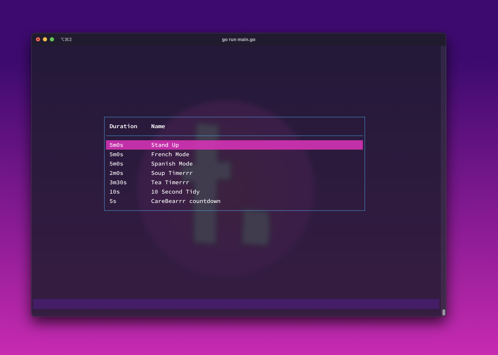
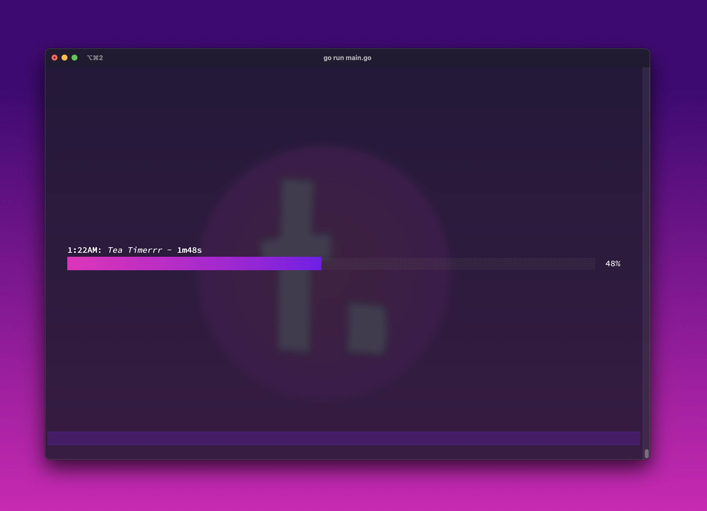

# ⏳ timerrr

`timerrr` is a command line-based timer app written in Go.

🎬 See [video](https://github.com/techygrrrl/timerrr/commit/ada55c808fd77cff61de555bc35b839960b03f7a#r105166581)

- [💽 Installing](#-installing)
- [💼 Contributing](#-contributing)

## 💽 Installing

Install the CLI:

    go install github.com/techygrrrl/timerrr@latest

For detailed usage instructions, see the [Installation and Usage Guide](https://github.com/techygrrrl/timerrr/wiki/Installation-and-Usage).

## 💼 Contributing

See the [contributor's guide](CONTRIBUTING.md).
